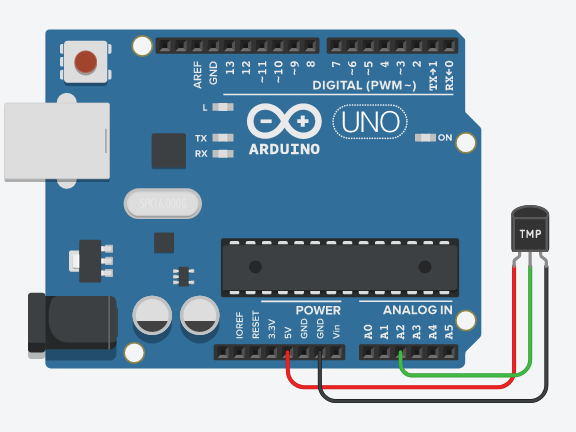
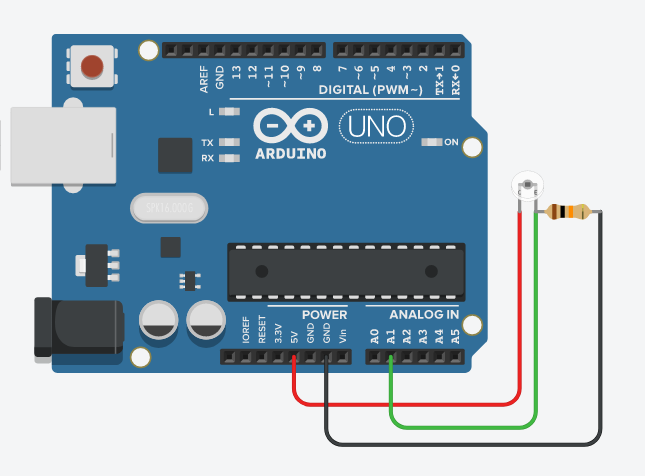
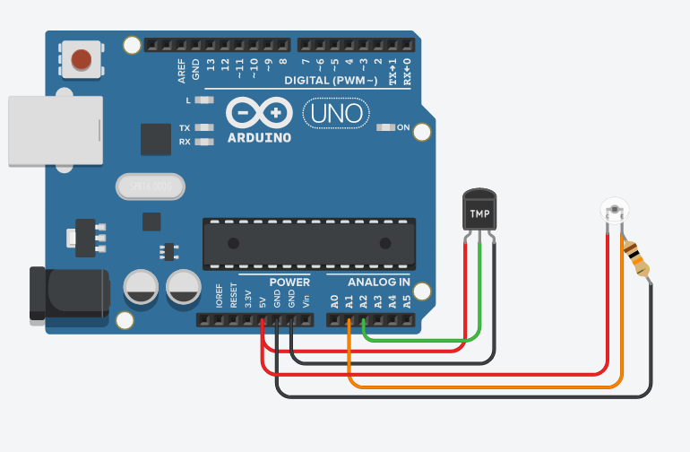

# Módulo Sensores

## Sensor de temperatura (TMP36)


Este sensor está sendo ligado em 5V, logo, sua ligação será simplificada. Sendo necessário apenas ligar o pino de potência à saída 5V do arduino, terra e o o pino Vout (pino do meio) à uma saída analógica da placa.

Para a parte do código, será necessário coletar a leitura do sensor e converter esse valor para a temperatura em graus celsius.

### Segue o esquema:



### Código:
```
//Variáveis
float temperatura = 0;
float tensao = 0;

//Setup
void setup() {
   Serial.begin(9600); //Inicializa o serial 
}

//Programa
void loop() {
  tensao  = analogRead(A2)*5;
  tensao = tensao/1024;
  temperatura = (tensao - 0.5)*100;// converte a leitura do sensor em ºC
  Serial.println(temperatura);
  delay(1000);
}
```


## Sensor de luminosidade (phototransistor)


Para o sensor de luminosidade, bastou-se fazer a leitura do da informação coletada pelo sensor. Para garantir que o sensor não queimasse, foi colocado um resistor de 10k ohms.

### Segue o esquema:



### Código:
```
//Variáveis
float lumi = 0;

//Setup
void setup() {
   Serial.begin(9600); //Inicializa o serial 
}

//Programa
void loop() {
  lumi  = analogRead(A1); //leitura do sensor
  Serial.println(lumi);
  delay(1000);
}
```

## Unindo os dois sensores em um único sistema

Como os dois sensores serão usados simultaneamente em uma única placa, será necessário unir os dois experimentos.

### Segue o esquema:



### Código:
```
//Variáveis
float temperatura = 0;
float tensao = 0;
float lumi = 0;

//Setup
void setup() {
   Serial.begin(9600); //Inicializa o serial 
}

//Programa
void loop() {
  tensao  = analogRead(A2)*5;
  tensao = tensao/1024;
  temperatura = (tensao - 0.5)*100;// converte a leitura do sensor em ºC
  Serial.print("Temperatura: ");
  Serial.println(temperatura);
  
  lumi  = analogRead(A1); //leitura do sensor
  Serial.print("Luminosidade: ");
  Serial.println(lumi);
  Serial.println();
  delay(1000);
}
```