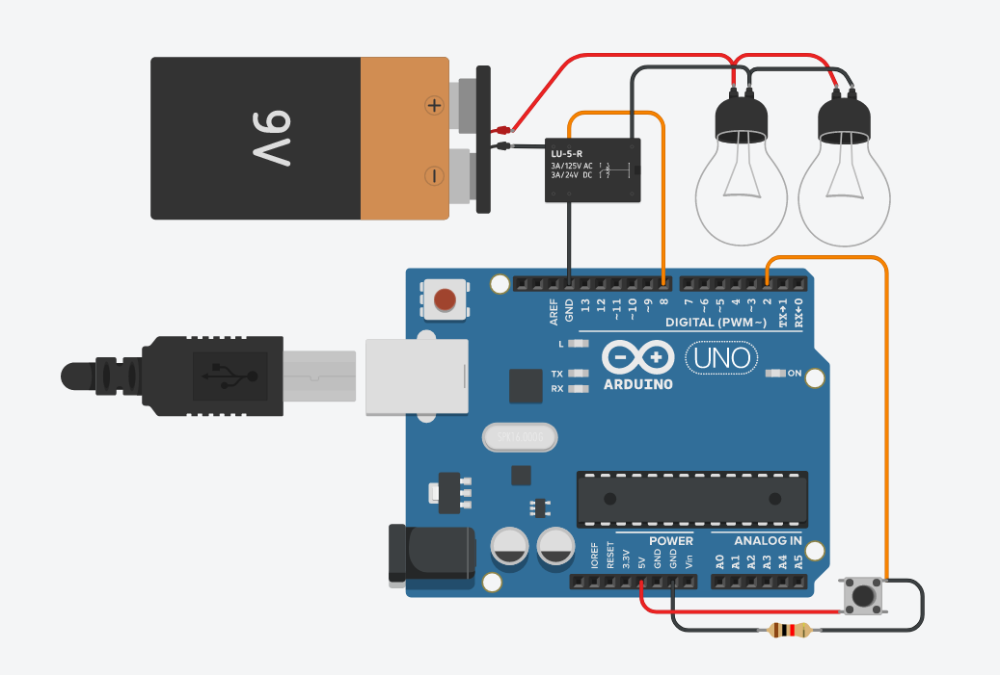

# Módulo Iluminação e Timer


## Componentes:


Neste módulo, será implementado um sistema que consegue acender lâmpadas incandescentes por meio do uso de um relé e um botão de interrupção.
A bateria de 9v irá simular uma corrente, ou seja, numa situação real, as lâmpadas estariam ligadas diretamente na energia do local.

Obs.: O resistor de 1K ohm é usado para ligar o botão.

As lâmpadas serão ligadas em paralelo, portanto, caso uma lâmpada queime, ela não vai interromper o funcionamento das demais lâmpadas. Além disso, com esse tipo de ligação, é possível ligar várias lâmpadas sem perder a intensidade da iluminação.

Neste exemplo, serão usadas 2 lâmpadas, porém, no sistema final serão usadas 4 lâmpadas.

## Primeira implementação:
A primeira implementação desse sistema consiste em usar o botão para alterar o estado das lâmpadas, ou seja, se elas estiverem apagadas e o botão for pressionado, as lâmpadas serão acesas. Caso elas estejam acesas e o botão seja pressionado, elas irão apagar.

### Segue o esquema:



### Código:
```
// Setup
void setup()
{
  pinMode(8, OUTPUT); //Relé
  
  pinMode(2, INPUT); //Push button
  attachInterrupt(digitalPinToInterrupt(2), acende, RISING);
}

//Variavel da luz e função de controle
volatile byte luz = 0;
void acende(){
  luz = !luz;
}

//Programa
void loop()
{
  if(luz == 1) digitalWrite(8, HIGH);
  else digitalWrite(8, LOW);
}
```


## Segunda implementação:
Nesta segunda implementação, foi adicionado um timer para as lâmpadas. Sendo assim, agora é possível programar o acionamento das lâmpadas para que ocorra de forma automática, estabelecendo um período de tempo para que sejam ligadas e apagadas.

Esse timer consiste em usar a função _millis()_ do arduino para recuperar o tempo atual de execução do sistema. Com isso, é possível fixar alguns tempos de execução e manipular o fluxo do programa.

O esquema de montagem continua o mesmo, haja visto que apenas o código foi alterado.


### Código:
```
// Variavel para armazenar por quantos segundos a lampada
//  esteve apagada
unsigned long timer_luz = millis();

// Setup
void setup(){
  pinMode(8, OUTPUT); //Rele
  
  pinMode(2, INPUT); //Push button
  attachInterrupt(digitalPinToInterrupt(2), acende, RISING);
}

//Variavel da luz e função de controle
volatile byte luz = 0;
void acende(){
  luz = !luz;
}

void timer_lamps(){ //faz as verificacoes periodicas
  if((millis() - timer_luz) >= 2000){// se as luzes ficaram 2s apagadas
    digitalWrite(8, HIGH); //acende as luzes
    delay(2000); //permanece aceso por 2s
  	timer_luz = millis();
  }
  else digitalWrite(8, LOW);
}

//Programa
void loop(){
  //o botao funciona de maneira independente, e possui precedencia,
  // ou seja, ao ser pressionado, ignora o timer
  if(luz == 1) digitalWrite(8, HIGH);
  else digitalWrite(8, LOW);
  timer_lamps();
}
```