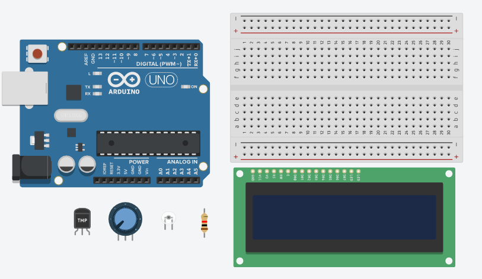
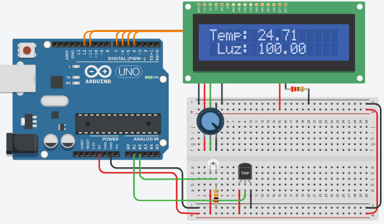

# Módulo LCD

## Componentes:



Tendo em mente que o criador de pintinhos sempre está checando os viveiros, conferindo o estado da criação, notou-se a importância de haver uma forma de dar um feedback para o criador acerca das informações do viveiro, como: temperatura, nível de água/ração, entre outros. Pensando nisso, foi implementado um visor LCD para apresentar tais informações em tempo real para o criador.

Este módulo será uma espécie de extensão do Módulo Sensores, pois o LCD irá mostrar as informações coletadas pelos sensores.


### Segue o esquema:



### Código:
```
// Setup
void setup()
//Inclusão da biblioteca do display lcd.
#include <LiquidCrystal.h>

//Declação do display;
LiquidCrystal lcd(12, 11, 7, 6, 5,4);

//Variáveis
float temperatura = 0;
float tensao = 0;

//Setup
void setup() {
  //Inicializa o LCD
  lcd.begin(16,2);
  lcd.clear();
}

float calcTemp(){
  tensao  = analogRead(A1)*5;
  tensao = tensao/1024;
  temperatura = (tensao - 0.5)*100;// converte a leitura do sensor em C
  return temperatura;
}

float calcLumi(){
	return analogRead(A2)/10;
}

//Mostra as informações dos sensores no LCD, em tempo real
void showInfos(){ 
  lcd.setCursor(6,0);
  lcd.print(calcTemp());
  lcd.setCursor(6,1);
  lcd.print(calcLumi());
}

//Programa
void loop() {
  lcd.setCursor(0,0);
  lcd.print("Temp:");
  lcd.setCursor(1,1);
  lcd.print("Luz:");
  
  showInfos();
}
```