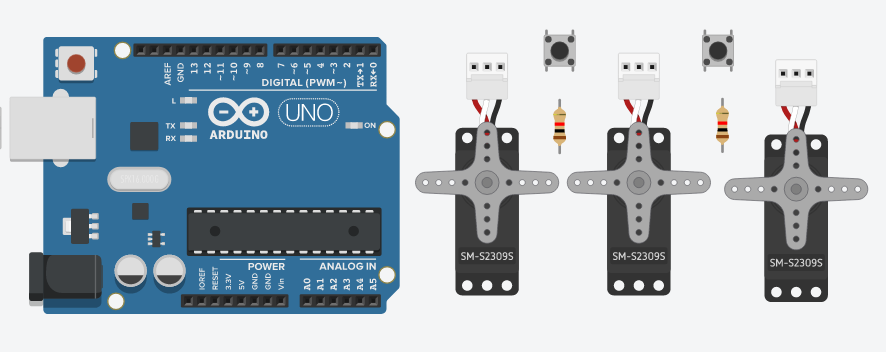
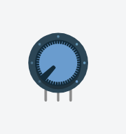
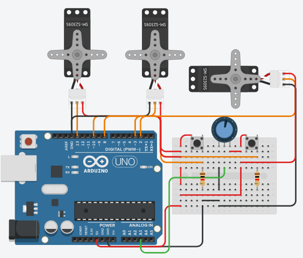

# Módulo Servos

## Componentes:



Neste módulo, uma das partes mais cruciais do projeto foi trabalhada, o sistema de alimentação.

O sistema de alimentação consiste em usar 3 servos (um abre o fundo do reservatório, para eliminar a água e outro para despejar água), 2 botões de interrupção e um timer. Dois dos 3 servos fazem parte do subsistema de troca de água e o terceiro servo faz parte do subsistema da reposição de ração.

Cada botão de interrupção está atrelado a um subsistema, tendo as seguintes funções:
- **Botão da troca de água:** ao ser pressionado, independente da temporização, aciona o processo de troca de água.
- **Botão da reposição de ração:** quando apertado pela primeira vez, movimenta o mecanismo do dispenser, despejando a ração. Ao ser apertado pela segunda vez, movimenta o mecanismo de modo que fecha o dispenser, parando de despejar a ração.

## Adição da balança:


Para melhorar o Módulo Servos, automatizando o sistema de reposição de reação, fora adicionado uma balança que ficara sob o recipiente de ração.



Para simular essa balança, foi utilizado um potenciômetro que consegue enviar um sinal para o Arduino que pode ser lido como um número de 0 à 1000. Este sinal númerico irá representar a quantidade em g (gramas) de ração no recipiente.

Logo, essa balança irá disparar um sinal quando o peso do recipiente estiver baixo, indicando que a quantidade de comida disposta para os animais está baixa. Isso fará que o sistema de reposição entre em ação e, quando os níveis de ração chegarem no limite máximo, a balança envia outro sinal indicando que o sistema pode parar de repor a ração.

A reposição de ração ocorre quando a quantidade de ração for menor que 300g. A partir do momento em que a reposição for acionada, ela vai despejar ração até que se tenha 900g de ração no recipiente.

O botão de interrupção terá uma nova função, ele será responsável por iniciar uma reposição manual (se o recipiente estiver com menos de 900g de ração), ou seja, antes que a quantidade de ração seja menor que 300g. Logo após o botão ser pressionado, o processo de reposição começa e termina de maneira análoga à reposição automática.

> Obs.: O botão só funciona quando não está acontencendo uma reposição no momento.

<br>

### Segue o esquema:



### Código:
```
#include <Servo.h>

//Declarando os servos
Servo servo_Comida;
Servo servo_rmvAgua;
Servo servo_addAgua;

//Variáveis
unsigned long timer_Agua = millis();
volatile byte est_botaoComida = 0;
volatile byte est_botaoAgua = 0;
volatile byte busy = 0;
volatile byte repondo_comida = 0;

//Setup
void setup(){
	//Servos
	servo_Comida.attach(8);
	servo_rmvAgua.attach(13);
	servo_addAgua.attach(10);

	//Botoes de interrupcao
	pinMode (2, INPUT);
	attachInterrupt(digitalPinToInterrupt(2), troca_estComida, RISING);
	pinMode (3, INPUT);
	attachInterrupt(digitalPinToInterrupt(3), troca_estAgua, RISING);
	
	//Balanca
	pinMode (A3, INPUT);

	//Inicializa os servos
	servo_addAgua.write(0);
	servo_rmvAgua.write(0);
	servo_Comida.write(0);
}

//Temporizador que aciona as trocas automaticas
void temporizador_agua(){
  	if((millis() - timer_Agua) > 3000 && !busy){
		troca_agua();
		timer_Agua = millis();
	}	
}


//Troca de agua
void troca_agua(){
	//Obs.: tempos de acionamento ficticios, apenas para teste
	busy = !busy;
	servo_rmvAgua.write(90);
	delay(2000);
	servo_rmvAgua.write(0);
	delay(1000);
	servo_addAgua.write(90);
	delay(2000);
	servo_addAgua.write(0);
	delay(1000);
	busy = !busy;
}

//Estado do botão de troca de comida
void troca_estComida(){
	est_botaoComida = !est_botaoComida;
}

//Estado do botão de troca de agua
void troca_estAgua(){
	est_botaoAgua = !est_botaoAgua;
}

//Balanca
void balanca(){
	//Quando o compartimento de comida estiver com 900g ou mais de racao, finaliza a reposicao
	if(analogRead(A3) >= 900 && repondo_comida){
		servo_Comida.write(0);
		repondo_comida = !repondo_comida;
	}
	//Caso o compartimento esteja em nivel baixo, aciona a reposicao
	else if (analogRead(A3) < 400 && !repondo_comida){
		servo_Comida.write(90);
		repondo_comida = !repondo_comida;
	}
	//Enquanto estiver repondo a racao, mantem o dispenser aberto
	else if (repondo_comida){
		servo_Comida.write(90);
	}
}

//Programa
void loop(){
	if(est_botaoComida==1 && !repondo_comida) {
		servo_Comida.write(90);
		repondo_comida = !repondo_comida;
		troca_estComida();
	}
	
	if(est_botaoAgua==1) {
		troca_agua();
		troca_estAgua();
	}
	temporizador_agua();
	balanca();
}
```