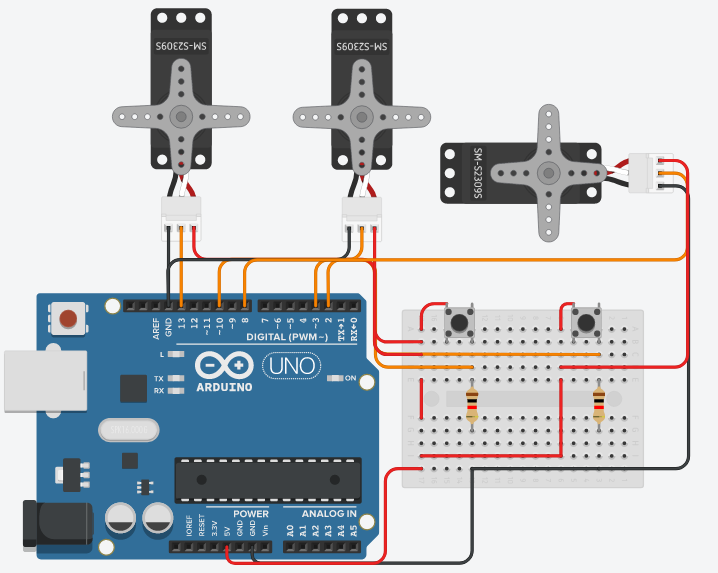

# Módulo Servos

## Componentes:


Neste módulo, uma das partes mais cruciais do projeto foi trabalhada, o sistema de alimentação.

O sistema de alimentação consiste em usar 3 servos (um abre o fundo do reservatório, para eliminar a água e outro para despejar água), 2 botões de interrupção e um timer. Dois dos 3 servos fazem parte do subsistema de troca de água e o terceiro servo faz parte do subsistema da reposição de ração.

Cada botão de interrupção está atrelado a um subsistema, tendo as seguintes funções:
- **Botão da troca de água:** ao ser pressionado, independente da temporização, aciona o processo de troca de água.
- **Botão da reposição de ração:** quando apertado pela primeira vez, movimenta o mecanismo do dispenser, despejando a ração. Ao ser apertado pela segunda vez, movimenta o mecanismo de modo que fecha o dispenser, parando de despejar a ração.

<br>

### Segue o esquema:



### Código:
```
#include <Servo.h>

//Declarando os servos
Servo servo_Comida;
Servo servo_rmvAgua;
Servo servo_addAgua;

//Variáveis
unsigned long timer_Agua = millis();
volatile byte est_botaoComida = 0;
volatile byte est_botaoAgua = 0;
volatile byte busy = 0;

//Setup
void setup(){
	//Servos
	servo_Comida.attach(8);
	servo_rmvAgua.attach(13);
	servo_addAgua.attach(10);

	//Botoes de interrupcao
	pinMode (2, INPUT);
	attachInterrupt(digitalPinToInterrupt(2), troca_estComida, RISING);
	pinMode (3, INPUT);
	attachInterrupt(digitalPinToInterrupt(3), troca_estAgua, RISING);

	//Inicializa os servos
	servo_addAgua.write(0);
	servo_rmvAgua.write(0);
	servo_Comida.write(0);
}

//Temporizador que aciona as trocas automaticas
void temporizador_agua(){
  	if((millis() - timer_Agua) > 3000 && !busy){
		troca_agua();
		timer_Agua = millis();
	}	
}

//Troca de agua
void troca_agua(){
	//Obs.: tempos de acionamento ficticios, apenas para teste
	busy = !busy;
	servo_rmvAgua.write(90);
	delay(2000);
	servo_rmvAgua.write(0);
	delay(1000);
	servo_addAgua.write(90);
	delay(2000);
	servo_addAgua.write(0);
	delay(1000);
	busy = !busy;
}

//Estado do botão de troca de comida
void troca_estComida(){
	est_botaoComida = !est_botaoComida;
}

//Estado do botão de troca de agua
void troca_estAgua(){
	est_botaoAgua = !est_botaoAgua;
}

//Programa
void loop(){
	if(est_botaoComida==1) servo_Comida.write(90);
	else servo_Comida.write(0);
	
	if(est_botaoAgua==1) {
		troca_agua();
		troca_estAgua();
	}
	temporizador_agua();
}
```