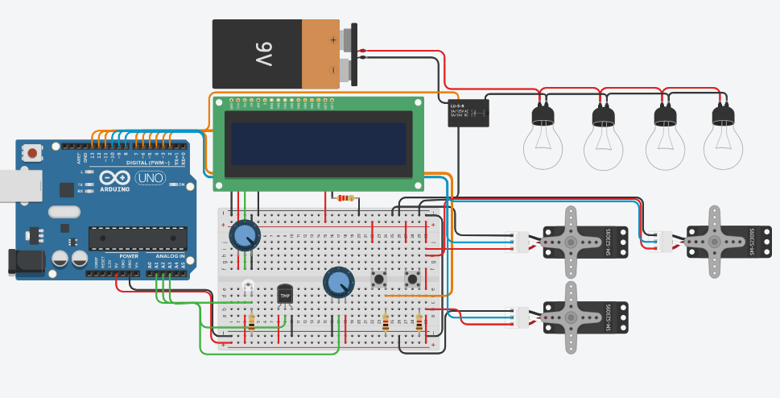

# União dos módulos anteriores

## Montagem:

## Informações:
Acerca do módulo de iluminação, foram acrescidas 4 lâmpadas ligadas em paralelo, sendo assim, caso alguma queime, o sistema não será prejudicado.

Para facilitar a visualização, os servos foram dispostos de maneira semelhante à aplicação real. Ou seja, os dois módulos da esquerda são referentes ao subsistema de reposição da água, sendo o servo inferior responsável pela remoção da água e o superior da adição.

Os botões estão dispostos na mesma ordem dos servos, logo, o botão da esquerda ativa a reposição da água e o da direita, a reposição da ração.

O potenciômetro à esquerda do botão de reposição da água é referente a balança.

## Código:
Em relação ao código, utilizou-se as funções dos módulos anteriores e foram feitas algumas adaptações. O que resultou em um código-fonte completo com todas as funcionalidades previstas até este momento para o projeto.

Por estar muito extenso, o código não será colocado aqui. O código-fonte pode ser acessado no arquivo [união.ino](./uniao.ino)
