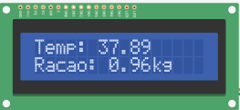
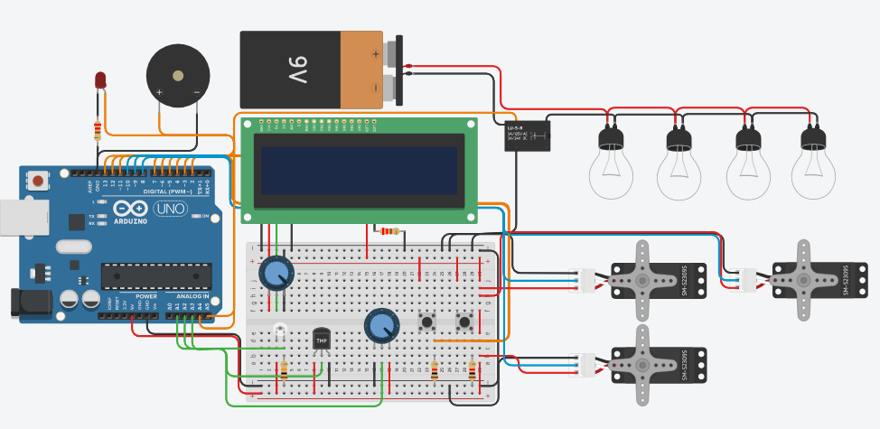

# Ajustes finais

## Novos componentes:

Como mecanismos para tratamento de possíveis falhas, foram acrescidos dois componentes: um buzzer (à direita) e um ventilador (simbolicamente representado por um LED).

## Informações:
O buzzer tem como finalidade de servir como um alarme que vai ficar disparando sinais sonoros até que a situação se normalize.

Ele pode ser acionado toda vez que a temperatura estiver abaixo de 35°C ou acima de 40°C, pois essas faixas de temperatura são prejudiciais para os pintinhos.
- Caso a temperatura esteja abaixo de 35, além do buzzer, as lâmpadas também serão acionadas para conseguirem estabalizar a temperatura, assim que a temperatura ideal for atingida, elas se apagam.
- Caso a temperatura supere os 40°C, além do buzzer, o ventilador para que a temperatura baixe e se normalize. Assim que o viveiro atingir a temperatura ideial, tanto o ventilador quanto o buzzer serão desligados.

## Última atualização: feedback de funcionamento no LCD

Como planejado, o LCD agora passa a exibir informações referentes ao funcionamento em tempo real do sistema. Portanto, o mesmo passa a exibir, por padrão, a temperatura do viveiro e a quantidade de ração presente no reservatório. Além disso, ele também exibe as seguintes informações:
- Quando o sistema está repondo a ração: exibe a mensagem no LCD "Repondo a ração...", e permanece exibindo a mensagem até que a reposição termine;
- Quando o sistema está repondo a água: exibe a mensagem no LCD "Repondo a água...", e permanece exibindo a mensagem até que a reposição termine;
- Quando o sistema está em estado de alerta, ou seja, quando a temperatura não está na faixa ideal, o LCD exibe um ponto de exclamação "!" no canto superior direito. Este aviso some caso a situação se normalize.

## Montagem:

## Código:
Por estar muito extenso, o código não será colocado aqui. O código-fonte pode ser acessado no arquivo [ajustes.ino](./ajustes.ino)