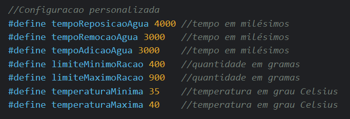

# Kit de Automação para viveiro de pintinhos

## Visão geral
O produto trata-se de um kit para automatizar alguns cuidados em viveiros de pintinhos. Com ele, é possível automatizar a processo de reposição de água e ração. Além disso, o kit consegue gerenciar a temperatura do viveiro, fazendo o uso de sensores, lâmpadas e um ventilador.

O código-fonte pode ser acessado [aqui](./ProjetoFinal.ino).

## Configurações personalizadas
O produto final conta com a possibilidade do criador personalizar alguns parâmetros do sistema, alterando algumas temporizações ou valores.

### Configurações possíveis:

### Legenda das configurações:

- **tempoReposicaoAgua:** determina a periodicidade da reposição da água;
	> Exemplo: se tempoReposicaoAgua = 3000 (3s), a reposição ocorrerá a cada 3s.

- **tempoRemocaoAgua:** determina quanto tempo a parte inferior do reservatório ficará aberta para que a água já existente seja removida;

- **tempoAdicaoAgua:** determina quanto tempo a parte superior do reservatório ficará aberta para que a nova água seja adicionada;

- **limiteMinimoRacao:** quantidade mínima de ração que o reservatório pode ter sem que a reposição seja acionada;

- **limiteMaximoRacao:** quantidade máxima de ração que o reservatório pode suportar;

- **temperaturaMinima:** temperatura mínima que o viveiro pode atingir sem que prejudique os pintinhos;

- **temperaturaMaxima:** temperatura máxima que o viveiro pode atingir sem que prejudique os pintinhos;

## Reposição de água e ração

As trocas automáticas de água ocorrem por meio de um sistema mecânico que abre a parte inferior do reservatório de água para eliminar a água suja/velha, depois o fecha e abre a parte superior do reservatório.

Ao abrir essa parte superior, a nova escoa para o reservatório e após um certo tempo, a parte superior é fechada. Tudo isso em um período que pode ser determinado pelo comprador, para atender as mais diversas situações.

Para repor a ração, o sistema faz uso de uma balança que monitora a quantidade de ração no reservatório de ração. Quando ele atinge o limite mínimo, a reposição é acionada e para assim que encher o reservatório novamente.

As reposições são notificadas no LCD.

Ambos os sistemas de reposição podem ser acionados manualmente, com algumas exceções:
- Quando acionada a reposição manual da água, ao terminar a reposição, seu timer é resetado. Essa é uma medida para garantir que a reposição automática não seja iniciada logo após uma reposição manual;
- A reposição manual da ração só é iniciada se o reservatório não estiver cheio.

## Controle de temperatura
Como parte do sistema de controle de temperatura, têm-se as lâmpadas, sensor de temperatura e ventilador.
As lâmpadas são acionadas quando a temperatura está baixa e o ventilador quando a temperatura está alta.

A temperatura é exibida em tempo real no LCD e também é sinalizado por meio de uma exclamação "!" no canto superior direito do LCD quando a temperatura não está adequada.

## Iluminação
Além de ser acionadas por conta do sensor de temperatura, as lâmpadas também podem ser acesas de acordo com iluminação externa. Portanto, quando anoitece, as lâmpadas são acionadas e quando está de dia, elas se apagam.

Caso a temperatura se eleve durante a noite, o sistema de controle de temperatura possui prioridade, logo, ele irá desativar as luzes até que a temperatura se normalize.

## Sistema de alarme
O sistema de alarme é composto pelo buzzer e LCD. O sistema tem como objetivo informar no LCD (por meio do caractere "!" no canto superior direito da tela) e disparar sinais sonoros quando uma irregularidade na temperatura do viveiro for indicada, emitindo som até que a situação se normalize.

Ele é acionado toda vez que a temperatura estiver abaixo de 35°C ou acima de 40°C, pois essas faixas de temperatura são prejudiciais para os pintinhos.