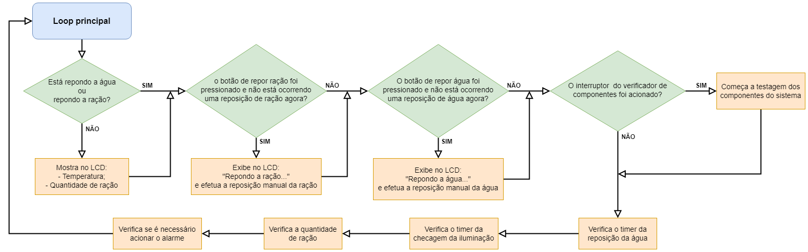

# **Kit de Automação para viveiro de pintinhos**

### **Discente:** Gabriel de Oliveira Santos
### **Docentes:** Bruno O. P. Prado e Marco T. Chella
### **Turma:** T02

## **Sobre o projeto:**

O mesmo se trata de um Kit de automação para viveiros de pintinhos. O projeto foi desenvolvido através da plataforma TinkerCad, tendo como núcleo o uso do Arduino Uno R3.

#### Link para o vídeo de apresentação/demonstração: [clique aqui](https://youtu.be/y7Wwthm2X3s).

#### Link para o slide do vídeo: [clique aqui](https://drive.google.com/file/d/18LDEdYvpb_x06BdekQDMNSgDQEDX0thg/view?usp=sharing).

#### Link para o slide Pitch do produto: [clique aqui](https://drive.google.com/file/d/1FXR7Pblmw9-ygJToVi3Be3Yff-kcoqTP/view?usp=sharing).

#### Link para o Projeto no TinkerCad: [clique aqui](https://www.tinkercad.com/things/dI47YsIoyZI?sharecode=rwJta748ZPPNbRexio5A3HT2yMuB3HLH1L5iRSYlwyw).

#### Código-fonte do Projeto Final: [clique aqui](./7-Projeto%20Final/ProjetoFinal.ino).

#### Pequeno relatório acerca do Projeto Final: [clique aqui](./7-Projeto%20Final/relatório.md).

 

### O kit conta com os seguintes componentes:
- 1x | Arduino Uno R3;
- 3x | Micro servo;
- 2x | Botão;
- 2x | 1K ohm Resistor;
- 1x | 10K ohm Resistor;
- 2x | 220 ohm Resistor;
- 1x | Sensor de temperatura [TMP36];
- 2x | 250k Potenciômetro;
- 1x | Relé SPDT;
- 1x | Bateria 9V;
- 4x | Lâmpada;
- 1x | Sensor de luz ambiente [fototransistor];
- 1x | LCD 16x2;
- 1x | LED vermelho;
- 1x | Buzzer;
- 1x | Interruptor deslizante.

Com todos estes componentes, foi possível montar um sistema que consegue efetuar trocas de água/ração e também controlar a temperatura interna do viveiro por meio do acionamento de lâmpadas incandescentes e um ventilador, tudo isso de forma autônoma, mas também permitindo que o sistema possa ser controlado de forma manual. Além disso, o mesmo conta com um sistema de alarme que é acionado quando o sistema entra em estado de alerta.

### Fluxograma do sistema:

Ver foto ampliada: [clique aqui](https://drive.google.com/file/d/1oGjAzLJr3ALBsLlNwFx5jXJnLixs3LGc/view?usp=sharing)

## **Como o repositório foi organizado?**
O desenvolvimento do projeto seguiu por meio de módulos, ou seja, o projeto foi fragmentado em partes menores que depois compuseram o projeto final.

Esses módulos foram organizados por pastas na raiz do repositório, enumerados pela sua ordem de execução. E os avanços serão exibidos através de um mini relatório (com imagens) acerca dos resultados obtidos em cada módulo, código-fonte e, para o sistema final, link do projeto na plataforma TinkerCad. Além disso, a aba _Projects_ do GitHub está sendo usada, logo, será possível observar qual ou quais módulos estão sendo trabalhados no momento.

## **Módulos:**
- **Sensores:** medição da temperatura e análise da luminosidade;
- **Iluminação e timer:** mecanismo para acender as lampadas de acordo com o tempo de execução;
- **LCD:** feedback visual acerca das informações coletadas/geradas;
- **Servos:** mecanismos responsáveis pela manipulação dos recipientes de ração e água;
	- Adicionando sistema de balança;
- **União dos módulos anteriores**;
- **Ajustes finais:**
	- Tratamento de falhas;
	- Feedback no LCD;
	- Verificador de integridade dos componentes.