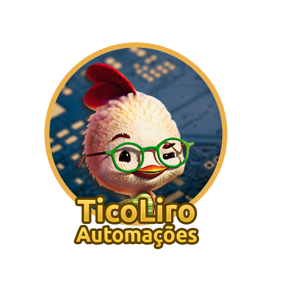

# **Kit de Automação para viveiro de pintinhos**

### **Discente:** Gabriel de Oliveira Santos
### **Docentes:** Bruno O. P. Prado e Marco T. Chella
### **Turma:** T02

## **Sobre o projeto:**

O mesmo se trata de um Kit de automação para viveiros de pintinhos. O projeto será desenvolvido através da plataforma TinkerCad, tendo como núcleo o uso do Arduino Uno R3.

O kit conta com os seguintes componentes:
- 1x | Arduino Uno R3;
- 3x | Micro servo;
- 2x | Botão;
- 2x | 1K ohm Resistor;
- 1x | 10K ohm Resistor;
- 2x | 220 ohm Resistor;
- 1x | Sensor de temperatura [TMP36];
- 2x | 250k Potenciômetro;
- 1x | Relé SPDT;
- 1x | Bateria 9V;
- 4x | Lâmpada;
- 1x | Sensor de luz ambiente [fototransistor];
- 1x | LCD 16x2;
- 1x | LED vermelho;
- 1x | Buzzer.

Com todos estes componentes, será possível montar um sistema que consegue efetuar trocas de água e ração e também controlar a temperatura interna do viveiro por meio do acionamento de lâmpadas incandescentes, tudo isso de forma autônoma, mas também permitindo que o sistema possa ser controlado de forma manual.

## **Como o repositório será organizado?**
O desenvolvimento do projeto seguirá por meio de módulos, ou seja, o projeto será fragmentado em partes menores que servirão tanto como objeto de estudo como também parte da versão final do projeto.

Esses módulos serão organizados por pastas na raiz do repositório, enumerados pela sua ordem de execução. E os avanços serão exibidos através de um mini relatório (com imagens) acerca dos resultados obtidos em cada módulo, código-fonte e, para o sistema final, link do projeto na plataforma TinkerCad. Além disso, a aba _Projects_ está sendo usada, logo, será possível observar qual ou quais módulos estão sendo trabalhados no momento.

## **Módulos:**
- **Sensores:** medição da temperatura e análise da luminosidade;
- **Iluminação e timer:** mecanismo para acender as lampadas de acordo com o tempo de execução;
- **LCD:** feedback visual acerca das informações coletadas/geradas;
- **Servos:** mecanismos responsáveis pela manipulação dos recipientes de ração e água;
	- Adicionando sistema de balança;
- **União dos módulos anteriores**;
- **Ajustes finais:**
	- Tratamento de falhas;
	- Feedback no LCD;